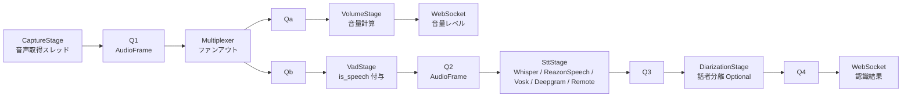
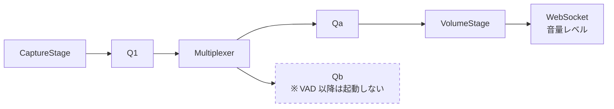

# ADR-002: STT パイプラインアーキテクチャ

- **ステータス**: Accepted
- **日付**: 2026-04-25

## 背景

現在の STT 実装（`stt_v2/`）は以下の問題を抱えている。

**1. 責務の混在**
各バックエンドクラス（`WhisperSttStream`, `DeepgramSttStream`）が音声取得・VAD・音声認識・ブロードキャストをすべて一クラスに持っている。VAD エンジンを変更するには各バックエンドクラスを修正する必要がある。

**2. soundcard の二重オープン**
`AudioLevelMonitor` が STT ストリームとは別に soundcard デバイスをオープンしている。同一デバイスを2つの接続で読み取っており、OS によっては競合・音量の不整合が起きうる。また `AudioLevelMonitor` は STT が停止していても動作させる必要があるため、現状ではライフサイクルが複雑になっている。

**3. エンジン切り替えコスト**
デバイス変更・VAD 変更・STT バックエンド変更のいずれも、ストリーム全体の停止と再起動が必要。VAD だけ変えたいのに Whisper モデルを再ロードする無駄がある。

## 決定

STT 処理を **キューで接続された独立したステージ（スレッド）のパイプライン** として設計する。

### データフロー



各ステージは独立したスレッドで動作し、前後のステージとはキューのみで通信する。

### Multiplexer（Q1 ファンアウト）

Python の `queue.Queue` はシングルコンシューマー前提。`VolumeStage` と `VadStage` が同一の Q1 を読むと片方しかフレームを受け取れない。そのため Q1 の直後に **Multiplexer スレッド**を挿入し、1 フレームを Qa・Qb 両方に複製して put する。

```
Q1 → Multiplexer → Qa → VolumeStage
                 → Qb → VadStage
```

Multiplexer 自身も `threading.Event` で個別停止する。

### PipelineStage 共通インターフェース

停止には 2 つの機構を用途で使い分ける。

**`threading.Event` — 個別ステージの停止（ホットスワップ用）**

デバイス変更・エンジン切り替えなど、パイプラインの一部だけを再起動するケース。下流を止めずに特定ステージだけを停止する。

```python
class PipelineStage(ABC):
    _stop_event: threading.Event
    _thread: threading.Thread

    def stop(self) -> None:
        self._stop_event.set()
        self._thread.join()
```

run ループは `queue.get(timeout)` + `stop_event.is_set()` の組み合わせ:

```python
def _run(self) -> None:
    while not self._stop_event.is_set():
        try:
            frame = self.input_q.get(timeout=0.5)
        except queue.Empty:
            continue
        if frame is None:
            break        # sentinel による終了も受け付ける
        # フレーム処理...
```

**sentinel `None` — パイプライン全体のシャットダウン**

会議終了など、全ステージを順番に停止するケース。Multiplexer が `None` を受け取ったら Qa・Qb 両方に転送することで、下流全体に伝播する。

```
CaptureStage → None → Q1
    Multiplexer: None → Qa(None) + Qb(None)
        VolumeStage: None → 終了
        VadStage:    None → Q2(None) → SttStage: None → ... → 終了
```

### ステージ一覧

| ステージ | クラス | 役割 | 入力 | 出力 |
|---------|--------|------|------|------|
| 音声取得 | `CaptureStage` | soundcard → PCM フレーム | — | Q1 (`AudioFrame`) |
| 音量計算 | `VolumeStage` | Q1 をタップし RMS 計算 | Q1 (read-only tap) | WebSocket |
| VAD | `VadStage` | 各フレームに `is_speech` を付与して全量通過 | Q1 | Q2 (`AudioFrame`) |
| 音声認識 | `WhisperStage` / `ReazonSpeechStage` / `VoskStage` / `DeepgramStage` / `RemoteStage` | `is_speech` を見てバッファリング・テキスト変換 | Q2 | Q3 |
| 話者分離 | `DiarizationStage` | 話者 ID 付与 (Optional) | Q3 | Q4 |
| 出力 | (パイプライン末端) | WebSocket ブロードキャスト | Q4 or Q3 | WebSocket |

### ファイル構成

```
app/stt/
├── __init__.py
├── pipeline.py          # SttPipeline: ステージを組み立て・起動・停止する統括クラス
├── stage_base.py        # PipelineStage ABC
├── stages/
│   ├── capture.py       # CaptureStage
│   ├── multiplexer.py   # Multiplexer (Q1 ファンアウト)
│   ├── volume.py        # VolumeStage
│   ├── vad.py           # VadStage (WebRTC VAD / Silero 切り替え可)
│   ├── stt_whisper.py   # WhisperStage
│   ├── stt_reazonspeech.py # ReazonSpeechStage
│   ├── stt_vosk.py      # VoskStage
│   ├── stt_deepgram.py  # DeepgramStage
│   ├── stt_remote.py    # RemoteStage
│   └── diarization.py   # DiarizationStage
├── factory.py           # build_pipeline(cfg, role, broadcast_fn) → SttPipeline
└── audio_source.py      # AudioSource protocol, SoundcardSource (変更なし)
```

### エンジン切り替えの動作

各ステージは独立して停止・再起動できるため、変更範囲を最小化できる。

| 変更内容 | 停止・再起動するステージ | 継続するステージ |
|---------|----------------------|----------------|
| 音声デバイス変更 | `CaptureStage` | VAD, STT, 音量計算 (キュー経由で継続) |
| VAD エンジン変更 | `VadStage` | 音声取得, STT |
| STT バックエンド変更 | `WhisperStage` → `ReazonSpeechStage` / `VoskStage` / `DeepgramStage` | 音声取得, VAD |
| 話者分離 ON/OFF | `DiarizationStage` | 全ステージ継続 |

### VolumeStage と AudioLevelMonitor の統合

現状の `AudioLevelMonitor`（`app/services/audio_level_monitor.py`）は STT とは独立した soundcard 接続を持っている。

新設計では `VolumeStage` が Multiplexer 経由で同一フレームを受け取るため:
- soundcard の二重オープンがなくなる
- STT が停止中でも `CaptureStage` + `Multiplexer` + `VolumeStage` だけを起動すれば音量モニタリングができる
- `AudioLevelMonitor` は廃止できる

セットアップ画面（会議開始前）での音量表示:



### VAD の設計

`VadStage` はエンジンをコンストラクタで受け取り、差し替え可能にする。
**フレームはフィルタせず全量通過させ、`is_speech` フラグを付与するだけ**にとどめる。
各 STT バックエンドが `is_speech` の遷移（False→True, True→False）を見て、プリロールバッファ・終末バッファ・KeepAlive・Finalize 等を自律的に制御する。

```python
@dataclass
class AudioFrame:
    pcm: bytes
    is_speech: bool
    timestamp_ms: float

class VadEngine(Protocol):
    def is_speech(self, frame: bytes, sample_rate: int) -> bool: ...

class WebRtcVadEngine:  ...  # webrtcvad ライブラリ使用 (MVP)
class SileroVadEngine:  ...  # Silero VAD (将来オプション)
```

**各バックエンドの `is_speech` 活用例**

- `WhisperStage`: `False→True` でプリロールバッファ（直前 300ms）を先頭に追加しセグメント開始。`True→False` が一定時間継続したらセグメントを確定して推論キューへ。
- `DeepgramStage`: `False→True` でプリロールバッファを送信開始。`True→False` で `{"type": "Finalize"}` を送信。`is_speech=False` が続く間は KeepAlive を 3 秒ごとに送信。
- `RemoteStage`: `is_speech=True` フレームのみ送信するか、全量送るかをリモートサーバーの仕様に応じて選択。

### キューの満杯ポリシー

キューはステージ間の受け渡しバッファ。**発話区間の蓄積など処理ロジックに必要なバッファは各ステージが内部に持つ**。キューのサイズとは独立して設計してよい。

キューが満杯のとき、ブロックせず**古いフレームを捨てて最新を入れる**。リアルタイム処理では積み残しより鮮度を優先する。

```python
def put_latest(q: queue.Queue, item) -> None:
    try:
        q.put_nowait(item)
    except queue.Full:
        q.get_nowait()   # 古い1件を捨てる
        q.put_nowait(item)
```

前提: キューの producer は1スレッドのみ。`get_nowait` と次の `put_nowait` の間に別 producer が割り込まないため、2回目の `put_nowait` が `Full` になることはない。

**キューごとの maxsize と用途**

| キュー | maxsize (目安) | 理由 |
|--------|--------------|------|
| Q1 (CaptureStage → Multiplexer) | 50 | フレーム連続性が必要。大きすぎると遅延が増える |
| Qa (Multiplexer → VolumeStage) | 50 | 古いフレームは `put_latest` で捨てるので大きさは重要でない |
| Qb (Multiplexer → VadStage) | 50 | VAD は連続フレームが必要。ドロップすると誤検出 |
| Q2 (VadStage → SttStage) | 200 | Whisper は推論に時間がかかるためバッファが必要 |
| Q3 (SttStage → DiarizationStage) | 10 | テキスト結果は小さい。溜まるなら処理が遅すぎる |

### SttConfig との関係

`SttConfig`（`app/core/config.py` に移動）が `backend`, `vad_aggressiveness`, `silence_duration` 等を保持する。`build_pipeline()` がこれを読んで適切なステージ実装を組み立てる。

## 結果

**ポジティブ**
- 新しい STT バックエンドの追加 → `stt/stages/stt_xxx.py` を1ファイル追加するだけ
- 新しい VAD エンジンの追加 → `VadEngine` Protocol を実装するだけ
- 音量モニタリングと STT が同一の soundcard 接続を共有するため、デバイス管理が単純化される
- 各ステージが独立してテスト可能（キューを与えてステージ単体を動かせる）
- 話者分離を「ステージを追加するだけ」で組み込める

**トレードオフ**
- `stt_v2/` の既存実装（`WhisperSttStream` 等）をステージベースに書き直す必要がある
- パイプラインのステージ数が増えるとデバッグ時にどのステージで詰まっているか追いにくくなる
  → 各ステージに structured logging（stage_name, queue_size 等）を追加することで対処する
- `VadStage` がフレームを全量通過させるため、Q2 のスループットは Q1 と同じ。フレームレートが高い場合（10ms/frame 等）はキューのバックプレッシャーに注意が必要
