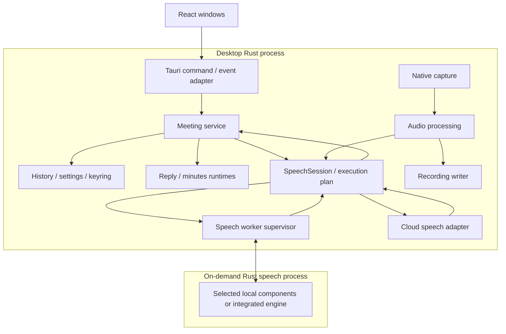

# ADR-016: Rust 移行時の実行境界と状態の所有者を明確にする

- **Supersession**: 議事録生成とクラウド音声認識の提供範囲は [ADR-019](./019-local-speech-and-saved-history.md) で部分置換する。
- **Status**: Proposed
- **Date**: 2026-09-29
- **Builds on**: ADR-002、ADR-003、ADR-009、ADR-010、ADR-015
- **Supersession**: Rust 直接接続の中断会議の扱いは [ADR-018](./018-interrupted-meeting-history.md) で部分置換する。その他は提案のままとする。

- **Partially superseded by**: [ADR-020](./020-versioned-rust-settings.md)（Rust の設定形式・旧設定と認証情報の扱い）

## Context

Rust 移行の目的は、通常起動から Python 環境の準備を除去し、会議中の応答性と障害時の扱いを改善することである。音声系はモデルに適した native engine を選び、ONNX への統一は要求しない。Silero / ReazonSpeech は ONNX、Whisper は専用 engine を第一候補とし、ローカル LLM のモデル実行基盤は後で検討する。React UI、利用者が判断して使う Live Reply、音声の送信先を選べる製品方針は維持する。

既存の責務分離を活かしつつ、Python のクラスやスレッド構成を一対一で Rust へ翻訳しない。現行コードで見直す対象は次のとおりである。これらはコード上の観察であり、個々の不具合や性能劣化を実機で再現したという意味ではない。

| 観察 | 設計上の課題 |
|---|---|
| [Tauri の起動](../../src-tauri/src/lib.rs)から Python 環境準備、子プロセス起動、health 待ちを経る | 画面の受付、永続化の準備、音声デバイス、モデル準備が異なるのに、起動の成否が一つに集約されやすい。 |
| [AppState](../../python/app/core/state.py)を会議 lifecycle、STT controller、会話処理が共有する | 複数の所有者と lock の組み合わせで遷移を理解する必要がある。Rust で全体を `Arc<Mutex<AppState>>` に置換しても解消しない。 |
| [会議 lifecycle](../../python/app/meetings/lifecycle.py)と [ReplyPipeline](../../python/app/services/reply_pipeline.py)が停止・キャンセル・保存を調整する | 開始中の停止、停止と最終結果の競合、旧会議の結果の拒否を全 adapter に通じる契約にする必要がある。 |
| [音声パイプライン](../../python/app/audio/pipeline.py)が stage ごとの thread / queue を持つ | 純粋な変換ごとに thread を増やす必要はない。一方、capture、推論、録音の遅延・欠落ポリシーは同じにできない。 |
| [SttPipeline](../../python/app/stt/pipeline.py)は全 backend の前に VadStage を挟む。一方、Remote 系は判定を使わず PCM を送り、Deepgram 系には provider 側の endpointing もある | `音声 → VAD → ASR` の固定形だけでは、複数機能を一括で担う実装の入力要件と確定責任を表せない。[DiarizationStage](../../python/app/stt/stages/diarization.py)は現在 pass-through の stub で、実際の話者推定は提供していない。 |
| [履歴 service](../../python/app/meetings/service.py)がバックグラウンド保存と完了待ちを持つ | 「画面に表示済み」「保存済み」「会議が完了済み」を区別し、保存失敗を成功に見せない契約が必要である。 |
| [BroadcastManager](../../python/app/services/broadcast.py)が接続先へ順に送信する | 遅い UI consumer と会議処理を切り離し、ウィンドウ再接続時の復元方法を明示する必要がある。 |

[Rust + ONNX 試作](../../test/rust-native-backend/README.md)で、Python なしの操作受付とモデルの遅延ロード、既存 VAD との比較を確認した。ただし、その JSON Lines protocol、単一音声 worker、固定設定を製品設計として採用したわけではない。

## Decision

以下を推奨する。`Proposed` の間は現行製品の実装 authority を変更せず、既存機能を削除しない。

### 実行単位は desktop 本体と音声推論 worker に分ける

Tauri 本体に会議制御・保存・設定・外部通信を置き、ONNX Runtime とローカル音声認識の native library は、必要時だけ起動する Rust の `speech-worker` に隔離する。通常起動で Python、uv、音声モデル、外部 provider の接続成功を要求しない。

音声取得と録音は推論 worker の外に置く。推論の異常終了時も、設定、会議終了、保存、録音を扱える構成にする。これは native 推論障害の分離であり、Tauri、OS 音声 API、ストレージを含むアプリ全体がクラッシュしない保証ではない。

図の local / cloud 分岐は選択した plan の実行先を表し、常に両方へ音声を送る意味ではない。外部 LLM・クラウド音声 service の通信は desktop 側の非同期 adapter に置く。音声推論 worker に API credential、会議履歴、keyring へのアクセスは渡さない。論理的な SpeechSession と process 境界は別であり、複合 plan ではローカル処理と外部通信を組み合わせられる。必要なローカル処理がない cloud plan は worker を起動しない。区間送信が必要な経路では worker から PCM を上限付きで返す。

Native API の hang は Rust task の abort だけでは止められない。supervisor は heartbeat に加え、prepare と各推論 job の期限を管理する。制御 thread だけが応答する状態でも期限切れを検知し、協調停止の猶予後は worker を終了して wait/reap する。期限はモデル・実行デバイスの測定で設定し、超過が必ずバグを意味するとは扱わない。

worker は勝手に無限再起動しない。失敗後は明示的な再準備で再起動でき、新しい worker 世代を割り当てる。処理中の音声と結果の保証範囲を利用者に示し、失われた音声を後続区間に無言で接続しない。capture 自体の障害は別の状態として扱う。

### SpeechSession は部品の分割数に依存しない

会議 service から見た境界は、音声入力を受け取り、文字起こし・発話活動・話者情報を返す `SpeechSession` とする。VAD、ASR、diarization は提供能力であり、常に三つの stage・trait object・process が必要という意味ではない。統合ライブラリの内部 VAD を外からもう一度実行する構成にしない。

| 実装の型 | SpeechSession の内部構成例 | アプリ側で追加する処理 |
|---|---|---|
| ASR の部品を使う | Silero → segmenter → Whisper / ReazonSpeech | 入力区間をアプリ側で作る。話者推定は必要なら別に追加する。 |
| VAD + ASR の統合 engine | 連続音声 → 統合 engine | 内部の発話区切りを使う。必要なら外部 diarization と時刻で結合する。 |
| VAD + ASR + diarization の統合 service | 連続音声 → provider session | provider の結果を共通形式へ変換する。ローカル VAD / segmenter / diarizer を必須にしない。 |
| 発話単位の service を使う | ローカル区間処理 → 音声 upload | service が要求する形式・上限で区間を作る。service 内部にも VAD があるだけでは連続音声対応と見なさない。 |

これは対応させる構成の種類であり、特定の service の全機能が既に利用可能という宣言ではない。能力は provider 名だけでなく、model・API・選択 mode・有効にした option ごとに adapter が宣言する。

#### 能力と実行 plan を分ける

`has_vad` のような boolean だけでは判断しない。adapter の静的な対応能力と、準備時に確認した有効能力を基に、選択した設定を一つの `SpeechPlan` に解決する。

| 契約 | 宣言する内容 |
|---|---|
| 入力 | `ContinuousAudio` / `UtteranceAudio`、encoding、sample rate、channel 数、必要な連続性、上限・flush / finalize 操作 |
| 発話活動 | 内部処理のみ / 外部へ時刻付き通知可能。内部 VAD があることと、その判定を取得できることを区別する。 |
| 発話区切り | client / engine / provider のどれが区切るか、外部 commit を受け付けるか |
| 認識出力 | interim / final / revision、時刻の有無と粒度、順序、訂正可能な範囲 |
| 話者情報 | なし / channel 由来 / diarization、word または区間への付与、途中結果と後からの訂正、label の有効範囲 |
| 入力のまとめ方 | source ごとの独立 session / 明示的な multichannel session。異なる device の音声を勝手に混合しない。 |
| 運用 | local / remote、準備条件、実行中 cancel の対応範囲、切断・欠落時の再開条件 |

plan は、入力変換、送信の gate、発話区切り、認識、話者情報の付与の担当を決める。一つの engine が複数の担当を持てるが、同じ役割の確定責任を二つの処理に与えない。明示的に選ばれた合成方式は一つの resolver が調整する。provider を増やすたびに汎用 graph planner を拡張する構成にはせず、検証済みの構成を明示的に追加する。

音声中の発話活動、provider の認識断片の確定、会話としての発話終了は別である。provider の `is_final` をすべて `UtteranceEnded` に変換せず、adapter が仕様に沿って区別する。ローカル VAD が観測用に並行して動いても、provider 所有の endpointing を勝手に上書きしない。メモリ・入力長を守る安全上の上限到達は、自然な発話終了とは別の理由として返す。

provider が無音を含む連続入力を要求する場合、既定ではローカル VAD で無音を削除しない。切り詰めると文脈、endpointing、話者推定、timestamp が変わるためである。転送量・費用・privacy のためのローカル gate は別の明示的な方針とし、provider の許容形式、preroll、keepalive、送信時刻から capture 時刻への写像を検証した plan だけで有効にする。不適合な組み合わせは準備時に理由付きで拒否し、黙って機能を落とさない。

#### 話者情報を source と分離する

既存の `self` / `other` は入力元の role であって、推定した人物 ID ではない。remote 音声には複数人が含まれ得るため、`source_id` / `channel_id` と、session 範囲で有効な `speaker_label` を分ける。同じ `speaker_0` が再接続後や別 service でも同じ人物とは仮定しない。ASR に時刻がなく外部 diarization と安全に対応付けられない組み合わせは、word / 区間への話者付与を非対応とする。利用者による人物への対応付けは別に扱う。

ここでいう diarization は「誰がいつ話したか」の推定であり、重なった声を別の音声波形へ分離する source separation とは別の能力である。diarizer は元の連続音声を必要とする場合があるので、ASR の後段にテキストだけを渡す固定配置にしない。並行に処理する場合は上限付きの音声保持と共通の時間軸を使い、元の音声がもうなければ後から解析できると装わない。

`SpeechEvent` は `TranscriptUpdated`、必要なら `ActivityObserved` / `UtteranceEnded`、`SpeakerAssignmentUpdated`、`InputGap`、`Completed` / `Failed` を扱う。名称は設計上の例であり、現行の生成契約へはまだ追加していない。本文は utterance ID と revision、話者情報は対象の時間範囲と独立した revision を持つ。単語時刻がある場合は単語にも対応付けられる。話者情報だけの訂正で別の発言を増やしたり、Live Reply を二重に起動したりしない。

話者推定が遅れても、最終本文と入力元が確定すれば Live Reply は処理できる。未確定の話者は unknown として扱い、後続の訂正は表示・保存へ反映する。統合 engine が話者の異なる複数区間や同時発話を返す場合も、全文に一人の speaker を強制しない。本文と時刻しか取得できない API から word 単位の話者ラベルを捏造しない。本文の訂正も新しい発言ではなく同じ ID の更新とし、既に開始した生成には用いた revision を記録する。

#### Session の準備と終了を構成に合わせる

外側の操作は prepare、音声の受渡し、end-of-input / flush、cancel、close とする。`flush` は受付済み音声の結果を期限内で待ち、`cancel` はそれ以降の結果採用を止める。内部に独立 VAD がない session に VAD 単体の start / stop を要求しない。plan に含まれる必要な処理だけを準備し、完了時にどの入力位置まで処理したかと未完了の認識・話者情報を明示する。

本文 final、発話終了、話者情報の最終化、session 全体の完了は区別する。話者情報は宣言した訂正範囲と session 終了期限内で受け付け、期限までに届かない結果は未解決として保存する。終了済み会議へ無期限に訂正を追加しない。会議停止時の世代チェックと保存 barrier は SpeechSession を単位に適用する。

必要な機能が unavailable の場合は開始前に通知する。任意の diarization の実行中失敗は認識を継続できるなら degraded として扱えるが、選択していない外部 service へ自動転送しない。会議中は plan を固定し、切断からの再開や構成変更には新しい session 世代と時間・speaker label の境界を設ける。

### Rust の型で状態と失敗を表す

回復可能な失敗は `thiserror` による error enum と `Result` で表す。呼び出し側が分岐する理由を文字列の比較に依存させない。IPC には locale-neutral な error code を返し、モデル path、音声、native の生 stderr を含めない。

処理 plan、認識結果、入力元の状態などの排他的な選択肢には enum を使う。モデル準備前後のように使用可能な操作が変わる境界には typestate を使い、`SpeechSession<Unprepared>` から準備に成功したときだけ `SpeechSession<Prepared>` を得る。IPC や非同期処理から届く動的な状態遷移は enum と境界検証で扱い、すべてを型パラメーターにしない。型で表せる状態でも、native 推論の失敗、プロセス停止、timeout は実行時に処理する。

### 状態の変更者を一つにする

会議ごとの正本は `MeetingService` が所有する。command と完了通知を順に処理する一つの mailbox を持ち、UI、推論、provider、DB worker は会議状態を直接書き換えない。

これは全処理を一つの thread で実行する意味ではない。純粋な遷移で開始する effect を決め、DB I/O・推論・ネットワーク待ちは所有する task に任せ、結果を mailbox に戻す。長い処理を待つ間も Stop / Cancel を受け取れるようにする。再入可能な同期 callback や lock を保持したままの I/O 待ちは使わない。

| 所有者 | 所有する状態・資源 | 他の部分へ渡すもの |
|---|---|---|
| Desktop supervisor | 起動状態、task / process handle、終了期限 | subsystem の状態と操作窓口 |
| Meeting service | 会議の遷移、会話、生成結果、保存状態、会議世代 | immutable snapshot、effect、UI 用の更新 |
| Audio service | device handle、入力 sequence、録音分岐、適用済み音声設定 | sample 位置を持つ PCM と欠落通知 |
| SpeechSession / supervisor / worker | 解決済み plan、session / worker 世代、必要なモデルと engine 内部状態、推論 queue | 世代・入力範囲・revision 付きの認識結果と話者情報 |
| Reply / minutes service | 各 use-case の生成 job と cancellation | 結果・途中経過・usage |
| Storage writer | SQLite connection、書き込み順序、transaction | commit / failure の通知 |
| UI adapter | 購読状態、公開用 DTO への変換 | snapshot と型付き event |

会議の状態は `Idle → Starting → Active → Stopping → Idle` を基本とし、補償や保存が完了できない場合は、会議 ID を保持した `RecoveryRequired` にする。失敗を `Idle` や `completed` に丸めない。開始途中の Stop も command として定義し、開始 effect が完了しても会議を Active に戻さない。

音声・STT の準備状態、録音の状態、AI の利用可否は会議状態から分離する。AI や録音だけの失敗を会議全体の失敗にしない。ストレージ障害時は新規会議を開始せず、開始済み会議には未保存状態を明示する。

### 受付、完了、キャンセルを別の契約にする

UI command は `request_id` と許可する入力だけを持ち、adapter が内部の会議・設定・worker 世代を付与する。command の受付応答は effect の完了を意味しない。完了・失敗・キャンセルは `operation_id` に対応する終端通知を一度だけ確定する。

非同期 job は必要な `meeting_id`、`meeting_epoch`、`operation_id`、`worker_epoch`、`config_revision` を開始時の snapshot として持つ。適用時に現在の世代と job の状態を照合する。Stop / Cancel を処理した時点で新しい副作用を禁止し、遅れて到着した文字起こしや LLM の完了を新しい会議へ反映しない。型だけでなく、この照合を共通の適用箇所で実施する。

Live Reply と MinutesGenerator は ADR-009 のとおり別の use-case とする。生成入力は不変の会議 snapshot とする。情報 AI は機能から削除し、移植対象に含めない。

キャンセルは結果の採用を止める操作であり、外部サービスの課金まで取り消せるという意味ではない。結果を破棄した job の usage は、判明した範囲で元の operation に帰属させる。ネットワーク再試行で LLM 生成を無条件に二重実行しない。重複した Start / Stop / Cancel は operation と状態から同じ結果へ収束させる。

### 起動時には必要なものだけを準備する

| 状態 | 完了を意味するもの | 待たせないもの |
|---|---|---|
| `shell_ready` | ウィンドウ、設定診断、command 受付が使える | DB migration、device 列挙、モデル、外部接続 |
| `meeting_ready` | 設定検証と履歴 DB の準備が完了し、開始前条件を評価できる | 未選択モデル、外部 AI の probe |
| `audio_ready` | 選択した入力が利用可能 | STT モデルの準備 |
| `stt_ready` | 選択した認識経路を利用可能 | 無関係な provider / model |

実際の Start 可否は必要な状態の組み合わせから決める。`shell_ready` を会議開始可能と表示しない。DB migration に失敗しても診断画面を表示できるようにし、会議操作は無効化する。

音量確認はセットアップで音声入力を使う時点で開始する。モデル準備は利用者の認識準備操作または会議開始の前提として行う。実測を踏まえた任意の prewarm は可能だが、通常起動で全モデルをロードしない。モデル取得は別 operation で、部分ファイルを ready と見なさない。

### 音声データと制御 command を分離する

capture callback では固定容量バッファへの書き込みと sample counter の更新だけを行う。推論、DB、ネットワーク、ログ整形、待機する lock を持ち込まない。PCM 正規化・resampling・音量集計のような軽い変換は Audio service にまとめ、関数ごとに thread を作らない。

録音 writer と認識・ネットワーク通信は別の実行単位とする。部品を組み合わせる plan では VAD と重い STT を分離するが、統合 engine の内部処理を無理に独立した stage に分解しない。音声 frame と Stop / Cancel を同じ FIFO に入れない。制御用 channel にも上限を設け、飽和を明示的に返す。停止・キャンセル通知には音声 backlog から独立した経路を使う。

PCM には `role`、入力世代、`frame_sequence`、`start_sample`、`sample_rate`、`sample_count` を持たせる。sample counter と monotonic clock の対応を入力ごとに保持し、UTC は履歴の表示用に分離する。二つの物理デバイスの clock が同期しているとは仮定しない。resampling 前後の位置関係を adapter が管理する。既存の公開 role は `self` / `other` を維持する。

| 経路 | 上限と満杯時の方針 |
|---|---|
| capture → 音声処理 | 音声時間と bytes で上限を設定する。callback は待たずに欠落を数え、次の消費時に不連続を通知する。 |
| 音量 → UI | 最新値にまとめる。表示が遅れても会議処理を待たせない。 |
| 音声 → SpeechSession | sequence の欠落を通知する。ローカル VAD を持つ plan は再帰状態と未完成区間を破棄する。統合 service は宣言した gap / reset 手順を使い、非対応なら session を更新する。欠落前後を連続音声として扱わない。 |
| SpeechSession 内の認識入力 | 区間入力なら区間数・総 sample 数・待機時間、連続入力なら bytes・音声時間・未確認位置を制限する。過負荷の未着手区間や送信欠落を明示し、連続性が必要な経路は reset / 再接続する。 |
| 音声 → 録音 | capture を止めず、記録できなかった sample 数と録音の不完全状態を保持する。欠落を成功扱いにしない。 |
| 文字起こし・返答 → 保存 | 有限の未保存枠を持ち、失敗・飽和を通知する。確定データを黙って落とさない。 |
| 更新 → 各 UI window | consumer ごとに分離する。状態更新を再取得できるようにし、遅い window を切り離しても処理を継続する。 |

枠数だけでなく bytes と音声時間で制限する。初期の容量・deadline は端末で実測して決め、試作の queue サイズをそのまま製品の基準値にはしない。通常の停止では最後に受理した sample の境界を固定し、期限内でその位置まで処理する。期限切れの未認識区間や未保存結果を完了扱いにしない。

### 保存は明示的な commit として扱う

ADR-003 の SQLite と録音ファイルの分離、既存 ID・保存先・削除確認を維持する。DB の唯一の writer は Storage adapter で、必須の保存を汎用 EventBus に委ねない。イベントソーシングの新設や DB の全面置換は行わない。

画面には途中結果を即時表示できるが、`pending` / `committed` / `failed` を区別する。確定した発言・返答は一意 ID で冪等に保存し、commit の結果が曖昧な再試行でも重複行を作らない。メモリ上の未保存枠が埋まった場合は認識・生成の新規受付を停止し、復旧または終了を促す。録音も別途、書き込み可能かを判定する。commit 前の内容はプロセス終了で失われ得るため、永続化済みとは表示しない。

開始は draft の commit 後に音声・録音を開始し、必須の開始処理が失敗した場合は補償して aborted を保存する。録音だけの失敗を非致命として通知する現行方針は維持する。終了は新規入力の境界確定、job の終端化、録音の finalize、保存の barrier、会議完了の commit を順序立てる。部分失敗時に completed を書かず、復旧可能な状態を残す。

SQLite とファイルは一つの transaction にならない。録音には一時ファイルと finalize 状態を持たせ、DB とファイルのどちらかだけが成功した場合に再起動後の照合で判別できるようにする。新しい永続状態の導入時は明示的な schema migration を用意する。旧 DB の copy を使った migration / rollback 検証が済むまで実データを書き換えない。

### UI は状態の正本を持たない

React は DTO の検証・表示・利用者操作を担い、会議の真の状態、保存結果、生成 job の生死を推測しない。UI local state は選択中のタブや入力 draft などに限定する。

Tauri command / event adapter を最終的な desktop transport とする。初期表示・window 再接続には `snapshot + revision` を用意し、更新には app instance と sequence を付ける。subscribe と snapshot の取得には基準 revision を共有する handshake を置き、その間の更新が抜けないようにする。有限の replay 範囲を超えた場合は snapshot を取り直す。

音量やダウンロード進捗の latest-value 通知と、会議状態を復元する更新 stream は分離する。返答の途中表示を含む現在の operation 状態は snapshot で復元できるようにする。最終状態を得るために、すべての token delta を無期限に保持しない。履歴全件は snapshot に入れず、ページ単位で取得する。

Rust の公開 DTO から TypeScript 型と検証可能な schema を生成する。生成された静的型だけで外部入力の検証を済ませない。API の変更時は Rust producer、生成物、React consumer、fixture を同じ切替に含め、旧 OpenAPI と新 DTO を二つの正本にしない。移行中の Python 契約は既存の生成経路を維持する。

エラー表示は ADR-015 の `UiMessage` に従う。会議 content と status descriptor を区別し、native error、path、provider 生応答を利用者向け値やログへ流さない。Tauri 側では window capability と command ごとの権限を維持する。transport を IPC に変えただけで任意の WebView に全権限を与えない。

### 境界を crate と module に反映する

最初から機能ごとに大量の crate や trait を作らず、重い依存を遮断する境界から分ける。以下は移行先の構成案で、まだディレクトリを作成した状態ではない。

| 配置案 | 内容 | 依存制約 |
|---|---|---|
| `src-tauri/` | desktop 起動、Tauri adapter、composition root | 会議の判断や推論処理を command 関数へ埋め込まない。 |
| `src-tauri/crates/meeting-core/` | 会議状態、SpeechSession の外部契約と plan 検証、use-case、effect / port、純粋な遷移 | Tauri、ONNX、SQL、provider SDK に依存しない。 |
| `src-tauri/crates/meeting-contracts/` | UI DTO、worker protocol、schema 生成 | transport ごとに module を分け、domain 内部型と同一視しない。他の製品 crate には依存しない。 |
| `src-tauri/crates/meeting-adapters/` | audio、storage、provider、worker client | core / contracts に依存する。外部 I/O の具体実装を module で分離し、ORT をリンクしない。 |
| `src-tauri/crates/meeting-speech/` | speech-worker binary、ローカル plan の部品構成または統合 engine | contracts に依存する。Tauri、会議 DB、credential store に依存しない。 |

core の純粋な遷移と audio DSP は transport を使わずテストできるようにする。async runtime の採用は application 層に閉じ、ドメインモデルに handle を持たせない。異なる実装を持つ必要がある保存・音声・推論・provider の境界でだけ port を作る。具体的な format 変換まで trait 化しない。

### Worker protocol とモデル配布を管理する

worker はバージョン付き handshake、能力、モデル状態、job ID、世代、制限値を持つ。model load と推論結果を混同しない。制御 message と PCM 用の channel を分離し、PCM は長さ付き binary として送る。JSON 配列や base64 を 30 ms ごとに UI や推論へ送る構成は採用しない。入力 packet と区間の総サイズを検証し、巨大区間は上限付きの分割転送にする。

初期実装は inherited pipe などのローカル IPC を使い、shared memory は計測で必要性が分かってから検討する。ネットワーク port を開けず、worker の実行ファイルと model / runtime path は desktop supervisor が配布 manifest から解決する。UI から任意の実行ファイルや dynamic library を指定させない。

Silero と ReazonSpeech の既存 ONNX を優先する。ReazonSpeech は Python binding を使わず、特徴量抽出と decoder を持つ sherpa-onnx native API を候補とする。worker ごとに互換な ONNX Runtime ABI を固定し、モデル ID・digest・入力仕様・decoder・runtime version を manifest に記録する。取得時に検証して atomic に配置し、ロード時は検証済み artifact と version を照合する。起動時に全モデルを走査・検証しない。

### Whisper は native engine adapter として追加する

モデル形式ではなく、load、認識 job、途中 / 最終結果、cancel、unload の操作境界を共通化する。内部の decoder、特徴量処理、モデル形式、GPU backend は各 adapter が所有する。上位の会議制御に engine 固有の object を漏らさない。

| 対象 | 第一候補 | 配布・状態の扱い |
|---|---|---|
| Silero VAD | ONNX Runtime | 現行モデル、話者ごとの recurrent state を維持する。 |
| ReazonSpeech | sherpa-onnx native API + ONNX Runtime | 現行 encoder / decoder / joiner を使う。 |
| Whisper | whisper-rs + whisper.cpp | 対応する ggml モデルを別 artifact として管理する。Python は不要である。 |

Whisper の第一候補は [whisper.cpp](https://github.com/ggml-org/whisper.cpp) の Rust binding である [whisper-rs](https://codeberg.org/tazz4843/whisper-rs) とする。2026-09-29 の調査では [whisper-rs 0.16.0](https://crates.io/crates/whisper-rs/0.16.0) が公開され、Metal / CUDA / Vulkan の feature がある。GitHub の旧 whisper-rs repository は Codeberg への移転を案内している。採用時は binding と内部の whisper.cpp の組み合わせを固定して各 OS で検証する。この ADR の更新で依存追加や認識実装を行ったわけではない。

Apple Silicon は Metal、CPU 環境は CPU を基準とし、Windows / Linux の GPU は Vulkan または CUDA を対象機器で評価する。GPU 対応 feature があることと、同じ installer がすべての端末で動くことは区別する。Core ML も候補だが、公式文書が初回実行の端末固有コンパイルを説明しているため、起動時間の比較ではそのコストを分ける。

現在の faster-whisper の CTranslate2 モデルは whisper.cpp に直接読み込ませられない。既存の model ID / cache を上書きせず、engine・model revision・量子化方式ごとの manifest で管理する。日本語には `.en` ではない多言語モデルを使い、まず同じサイズのモデルで精度と遅延を比較してから量子化を評価する。音声モデルは worker の準備時にロードして複数区間で再利用し、区間ごとに process やモデルを起動しない。

Whisper の初期 plan は、Silero VAD と区間処理を使った認識とする。内部 VAD を使う mode を追加する場合は別の検証済み plan とし、外部の区間処理を自動で重ねない。短い sliding window による途中表示を追加する場合は、重複除去・再デコードによる訂正・確定条件を adapter 内に閉じる。単に streaming example が存在することを、無制限の連続入力に対する確定的な token stream の保証とみなさない。

現行の幻覚抑制は `avg_logprob`、`no_speech_prob`、`compression_ratio` と音声側の根拠を利用する。新 engine の指標を同じ意味・閾値と仮定せず、取得不能な値を 0 で埋めない。共通の音声 gate と engine 固有の判定を分け、無音、短い日本語、長い発話、timestamp、cancel を評価する。認識結果・初回ロード・発話終了から確定までの時間・RSS / VRAM を測り、速度優位を事前に断定しない。

代替候補は [CTranslate2 の C++ API](https://github.com/OpenNMT/CTranslate2) と [Candle の Whisper 実装](https://github.com/huggingface/candle/tree/main/candle-examples/examples/whisper) である。前者は現行 engine の継続性を比較できるが、Rust binding に加えて faster-whisper 側の前処理・tokenizer・デコード制御の移植が必要になる。後者は Rust を中心に構成できるが、製品用の区間処理・出力・対応モデル / GPU の検証を担う範囲も評価する。実測前にいずれかを一律に最速とは扱わない。

Vosk は製品の対応対象から削除する。既存のユーザーモデルファイルは削除しない。runtime、モデル、decoder のライセンスと native 配布物は製品の通知生成に含める。

### Python が不可欠なモデルは専用 adapter から実行できる

Rust をバックエンドの主体とするが、Python の使用を禁止しない。モデル export・評価などの開発工程に加え、必要な AI モデルの実行が Python でしか実現できない場合は、製品から Python を呼び出すことも許容する。Python 専用モデルを選んだ plan の実行時依存として明示し、その機能を使うときだけ専用 worker を起動する。通常起動や Rust + Silero + ReazonSpeech の経路には Python の準備・起動を要求しない。

Python adapter も上位には同じ session / job 契約を提供し、入出力検証、世代、エラー、停止期限を守る。Rust の実装失敗を契機に無断で Python へ切り替えない。Python runtime は共通 worker にまとめ、モデル依存は必要な機能ごとに固定して、ユーザー環境の任意の Python や起動時の `pip install` に依存させない。この例外方針を決めたことで、未使用の汎用 Python runner を先行実装するわけではない。

### Python worker は PyInstaller の onedir 形式で配布する

Python 専用機能の配布方式には PyInstaller の `--onedir` を採用する。
Python interpreter と必要な Python package・native library・追加データを
共通の `meeting-python-worker` ディレクトリにまとめ、Rust が配布済み実行ファイルを直接起動する。
機能ごとに独立した PyInstaller bundle を作らず、サブコマンドで処理を選ぶ。
モジュールは選択された処理で遅延 import し、同時に実行するプロセスが複数でも配布物は共有する。
最初の用途は `convert-document` による MarkItDown の DOCX 変換とする。
[共通 worker の契約とビルド手順](../../python-worker/README.md)に実装範囲を記載する。
PyInstaller は Python の実行環境を梱包するものであり、推論コードの Rust 化や
PyTorch の import 時間・メモリ使用量の削減を保証するものではない。
通常の Rust 音声経路では Python worker を起動しない。

`--onefile` は起動時の展開コストがあるため標準にはしない。
Tauri のインストーラーまたは機能別の追加パッケージに worker ディレクトリ全体を含め、
内包するライブラリの相対配置を維持する。開発用 venv のコピーは配布物として使わない。
モデルは worker 実行ファイルに埋め込まず、互換性を確認した版を別のモデル領域で管理する。
実行ファイルの配置先には書き込まず、cache と一時データの保存先を明示する。

Rust と Python の通信には、Rust が起動した子プロセスの stdin / stdout を使用する。
制御と結果は version 付きの構造化メッセージ、音声などの大きなデータは上限付きの
長さヘッダーとバイナリデータで渡す。stdout は通信専用、stderr は診断用とし、
認識本文・認証情報を診断出力へ混ぜない。長時間動作する推論 worker は起動時に protocol version と有効な能力を照合する。
単発の資料変換はサブコマンドを固定し、要求・応答の version と要求 ID を照合する。
要求 ID、会議・worker 世代、結果の revision、入力検証、queue とデータ長の上限、
準備・推論・停止の期限は Rust worker と同じ責任境界で扱う。
協調停止できなければ supervisor がプロセスを終了・回収する。
会議・設定・履歴の正本は Rust に置き、Python はモデルと担当 job の状態だけを所有する。

PyO3 によるプロセス内埋め込みは標準経路にしない。
モデル固有の native library の停止不能・クラッシュを desktop 本体から分離するためである。
FastAPI サーバー全体を Python 専用機能の worker として持ち越さず、
実際に Python を必要とする機能が決まった時点で、その最小の entry point と
PyInstaller spec / hook を作る。利用先のない汎用 worker は先行実装しない。

uv は開発・CI・モデル変換・worker のビルド環境準備に使用し、
最終的な製品の実行時依存から外す。通常起動で `uv sync`、`pip install`、
Python の取得を実行しない。Python / uv がインストールされていない端末でも、
配布済み worker を起動できることを完了条件にする。
移行中の既存 Python バックエンドには現在の uv 経路が残るが、
この設計変更だけでその起動処理を削除したとは扱わない。

配布物は OS・CPU architecture・必要な CPU / GPU runtime ごとにビルド・検証する。
Python、PyInstaller、依存 package の版を固定し、モデルとの互換性、artifact の署名・digest、
protocol version を確認する。更新時は実行中の worker ディレクトリへ上書きせず、
停止後に検証済みの版を選択する。dynamic import、package data、DLL / shared library の
収集漏れは PyInstaller の自動解析だけに頼らず、実際のモデルロードと推論で検証する。
Python・ビルドツール・開発用 PATH のない環境、offline、空白・日本語を含む配置先で確認する。
Python 本体・各 package・native library・モデルの再配布条件は個別に確認し、
通知は既存の `scripts/third-party-licenses.py` に組み込む。

### Whisper の一般配布では CPU と GPU の依存を分ける

`whisper-rs 0.16.0` の `cuda` / `vulkan` feature と、それが依存する `whisper-rs-sys 0.15.0` の build script を確認した。GPU 非対応の binding ではない。CUDA は `GGML_CUDA`、Vulkan は `GGML_VULKAN` を有効にする。一方、同 script は CUDA の cuBLAS / CUDA runtime / driver library、または Vulkan loader も link 対象にする。whisper.cpp 本体を static link しても GPU 依存まで不要になるわけではない。根拠は [公開 crate の build script](https://docs.rs/crate/whisper-rs-sys/0.15.0/source/build.rs)である。

一般配布では、GPU 依存のない CPU worker を基本パッケージに含める。GPU worker は別ビルドの artifact とし、OS ごとに同梱または任意の追加パッケージにする。Cargo feature は加算されるため、一つの worker に全 backend を付けたビルドを CPU fallback と兼用しない。backend ごとに独立したビルドと artifact 管理を行う。

| 配布先 | 初期の推奨候補 | 実行時に確認する条件 |
|---|---|---|
| Apple Silicon | Metal worker と CPU fallback | 対象 macOS・GPU の対応と実際のモデル初期化・推論 |
| Windows / Linux の広い GPU 機種 | Vulkan worker と GPU 非依存の CPU fallback | loader、GPU driver、必要な Vulkan 機能、VRAM |
| NVIDIA で速度を優先 | 任意の CUDA worker | driver と配布 runtime の互換性、対象 compute capability、VRAM |
| GPU がない / 利用できない端末 | CPU worker | 明示した CPU 命令セットと OS runtime の条件 |

GPU worker の依存 DLL / shared library が欠けると、その process の main より前に loader が失敗する場合がある。そのため worker 内の `use_gpu=false` だけを復旧策にせず、desktop supervisor が起動失敗・初期化失敗・期限超過を検知して CPU worker を選択する。GPU / CPU の切替は世代を更新し、同じ結果を二度適用しない。GPU 検出だけで ready とせず、モデル初期化と推論の可否まで区別する。未選択の全 GPU engine をアプリ起動時に probe しない。

利用者には CUDA Toolkit、Vulkan SDK、Rust / C++ の開発環境を要求しない。SDK はビルド環境の依存である。実行に必要な再配布可能 library は配布物に含め、GPU driver は OS / hardware 側の前提として扱う。CUDA の再配布範囲は採用する Toolkit version の条件に従い、driver library を開発環境から無差別にコピーしない。optional package も署名・digest・protocol version を照合し、製品と整合した artifact だけをロードする。

CPU worker は CI 端末固有の最適化を避け、最低対応 CPU の命令セットを明示する。`GGML_NATIVE=OFF` だけで古い CPU すべてに対応できるとはみなさず、AVX / AVX2 等の設定と実機を確認する。Windows の C++ runtime、Linux の glibc baseline、macOS の deployment target も配布条件に含める。SDK と開発用 PATH のない clean 環境で、GPU library 不在、非対応 driver、CPU fallback、署名済み更新を検証する。この ADR の調査では各 GPU 上の実行を検証したわけではない。

### 独自 binding は必要な API に限定する

まず `whisper-rs` を利用する。whisper.cpp は C API を公開しており、CUDA / Vulkan を使うために独自の `cxx` bridge を作る必要はない。`cxx` は C++ API との境界を記述する手段で、GPU library の配布、driver 互換性、モデルロード時間を解決するものではない。

不足する公開 API が判明した場合は、upstream への追加、既存 sys binding の薄い wrapper、限定的な fork を先に評価する。独自の C++ facade や CTranslate2 の C++ API を公開する場合には `cxx` が候補となる。GPU backend の動的 plugin 配布など build script の変更が必要な場合も、まず native build と loader の設計課題として扱う。binding 全体を書き直す判断とは分ける。

## Migration boundary

移植途中の Python と Rust に同じ会議・デバイス・DB の所有権を与えない。製品版は一つの実装を選び、比較は独立した test process と合成データ・copy した fixture で行う。実ユーザーの音声を二つの provider へ送る shadow 実行や、同一 DB への dual write はしない。

切替の単位は「Rust 基盤と操作受付」「ローカル音声の縦断経路」「会議・保存・AI use-case」「製品配布から旧 runtime を除去」とする。各境界で DTO とテストを一括更新し、必要な比較 adapter には除去条件を設ける。移行を理由に恒久的な二重 schema や汎用 plugin framework を作らない。

現在の試作から再利用するのは ONNX の入力・状態検証と segmenter の比較結果である。製品接続の前に、会議 / worker 世代、強制終了期限、binary IPC、欠落通知、公開 role、可変設定、UI の snapshot を実装する必要がある。具体的な実装 task と進捗は [GitHub Issues](https://github.com/ouvill/meeting-supporter/issues)に分離する。

### 既存アプリへの段階的な接続

最初の移行では既存 React 画面、Python の取得・録音・会議管理を維持し、
ReazonSpeech を選択した場合の推論を Rust worker に差し替える。
`MEETING_REAZON_RUNTIME=rust` で Python の VAD / ASR stage を迂回し、
入力 PCM を worker に渡して確定結果を既存の会話・保存・AI 処理へ戻す。
停止時は最後の結果の受け渡しを待ってから会議を確定する。
これは通常起動の Python 依存をまだ除去しない移行用 adapter である。
音声取得・録音、会議管理・保存・設定、AI・外部サービスの順に所有権を移し、
この adapter を除去する。実行手順と制約は
[Rust 音声認識の既存アプリへの接続](../development/rust-local-speech.md)を参照する。

Linux の取得・録音移行では `meeting-audio-runtime` を別プロセスとして起動し、
PulseAudio / PipeWire の入力・モニター列挙、PCM 取得、音量計算、WAV 書き込みを所有させる。
推論 worker とは独立させ、転送側の欠落を連番で検出する。
Python adapter は既存の会議・録音資産サービスとの接続に限定し、会議管理の Rust 移行時に除去する。
これは Linux の開発用経路であり、他 OS の取得 adapter と一般配布の決定ではない。

### 独立した音声検証画面

以下の専用画面は worker の検証用であり、既存アプリの置換先にはしない。

`native-speech` feature で起動する Tauri モードは、Python の準備・起動・
managed session 同期を行わず、Rust のセッション管理から音声 worker を操作する。
既存 Python モードとは起動時に選択し、同じ会議やデバイスを同時に所有しない。
操作と snapshot は Tauri IPC で扱い、画面は revision を比較して古い応答を破棄する。

この初期接続では、既定マイクの取得と推論を一つの worker に置く。
録音保存は提供せず、worker 障害時は入力も停止する。
録音機能やシステム音声の接続前に、上記の方針に従って capture / recording を
推論 worker から分離する必要がある。固定 JSONL 制御・確定結果の経路も、
音声フレームを binary IPC で渡す製品構成への移行途中である。

起動・停止・結果の保持は
[meeting-speech-runtime](../../crates/meeting-speech-runtime/src/lib.rs)、
Tauri adapter は [native_speech.rs](../../src-tauri/src/native_speech.rs) が所有する。
会議履歴、録音、AI 支援、モデルの自動取得と一般配布はこの接続には含めない。
操作・検証手順は [Rust ローカル文字起こし](../development/rust-local-speech.md)を参照する。

## Verification criteria

| 境界 | 採用前に確認する挙動 |
|---|---|
| 起動 | Python 非導入・offline・モデル未導入でも shell が使える。`shell_ready`、会議開始可能、初回認識可能までを別々に測る。 |
| 遷移 | Starting 中の Stop、二重 Start、二重 Cancel、旧会議の STT / reply 結果、設定変更と worker 再起動の競合を決定的なテストで確認する。 |
| 隔離 | worker を意図的に終了・停止させても、UI、録音、保存、会議終了が使える。期限切れ job が成功として復活しない。 |
| 音声 | 両入力、device 切断、clock の差、queue 満杯、sample 欠落、長時間運転、各 OS の loopback を確認する。 |
| Speech plan | 部品構成、VAD + ASR 統合、全機能統合、区間 upload を契約 fixture で検証する。不要な VAD / worker が起動せず、endpointing の責任が重複せず、非対応設定を黙って無効化しない。 |
| 認識・話者結果 | provider の断片 final と発話終了、遅延する話者訂正、本文 revision、再接続後の label 再利用、重複 event、時刻不明、flush 期限を確認する。同じ発言が増殖せず、返答生成が二重に始まらない。 |
| 保存 | disk full、commit 失敗、書き込み直後の異常終了、DB と WAV の片側成功を注入し、保存済みの誤表示と二重書き込みがないことを確認する。 |
| UI | 遅い window が処理を塞がず、再接続・instance 変更・更新欠落時に snapshot で収束する。 |
| モデル | 同じモデルと合成入力での差分検証に加え、許諾済み評価音声で認識精度・区切り・言語・CPU/GPU 差を確認する。 |
| 配布 | 対象 OS の署名・ABI・ライセンス・モデル整合性・子プロセス回収を確認する。 |

性能評価は初回インストール、通常起動、更新直後を分け、対象端末の p50 / p95、RSS、queue 待機時間、音声欠落数、停止時間を記録する。数値目標は現行製品の計測と利用端末を基に決める。小さな試作の約 1 ms の受付時間を製品の合否基準にはしない。計測には内容を含まない時間・件数・状態 code を使い、音声、発話、prompt、credential を記録しない。

## Rejected Alternatives

| 案 | 今回推奨しない理由 |
|---|---|
| Python の class / thread をそのまま Rust 化 | 状態の所有者と停止・保存契約の複雑さが残る。 |
| 全 backend に VAD → ASR → diarization を強制 | 統合 engine の二重処理、provider の endpointing への干渉、連続音声を使う diarization の文脈欠落を招く。 |
| 任意の capability を自動結合する汎用 graph planner | 入力形式や確定・訂正の意味は boolean の組み合わせだけで安全に決まらない。検証済み plan を明示的に追加する。 |
| ONNX / STT をすべて Tauri process にリンク | IPC は減るが、native crash と停止不能を UI・保存から隔離できない。小さい試作では有用だが、堅牢性を重視する製品構成としては採用しない。 |
| バックエンド全体を Rust sidecar に置換 | 移行の比較候補にはなるが、推論障害が会議状態・保存まで巻き込みやすく、通常起動に別 backend の ready 待ちが残る。 |
| 全機能を別 process / microservice 化 | desktop に必要のない配布・監視・状態同期のコストを増やす。障害境界が必要な推論だけを分離する。 |
| 汎用 EventBus で必須の保存や停止を連携 | 順序、失敗、完了の責任が見えにくい。必須 effect は明示的な operation と acknowledgement にする。 |
| 初めから shared memory / lock-free を全面採用 | 複雑さに見合う効果が未測定である。capture 境界の非ブロック化を優先し、IPC は計測してから改善する。 |
| Rust 化と同時に全モデル・UI を変更 | 認識品質と移植不具合の切り分けが難しい。まず既存モデルと利用者の操作を保持して比較する。 |

## Consequences

起動に必要な処理が小さくなり、会議状態の変更箇所、遅延結果の採否、保存の完了条件を追いやすくなる。推論が落ちても会議の制御と記録を継続できる境界を持てる。

一方、worker protocol、process supervision、世代管理、UI 再同期、DB / 録音の復旧設計が必要になる。別 process のメモリと PCM 転送コストも発生する。Rust の型・所有権は実装を助けるが、外部 library、I/O、モデル品質の問題を自動的には解消しない。

独立した ONNX / STT worker の隔離方針、遅延初期化の UX、未保存・欠落時の状態表示をこの提案の主要な review 点とする。crate 名、IPC codec、容量・deadline の具体値、TS 生成器の選定は実装時の測定・検証で確定する。

## Supersession

この提案が Accepted になるまで既存 ADR は変更しない。採用時にも、既存文書全体を自動的に Superseded にしない。

- ADR-001: Python ディレクトリ構成は旧 runtime の除去時点で役割を終える。
- ADR-002: 固定 stage 列と stage ごとの thread / queue・停止方式を、SpeechSession の plan と Rust の実行・所有・欠落契約へ置換する。VAD の検出責務は維持するが、独立 stage は必須にしない。音声の二重取得を避ける原則と会議中の設定固定は維持する。
- ADR-003: 保存責務の Python 指定を Rust に置換し、commit / recovery を明確化する。SQLite と録音ファイルの分離、既存データ、削除確認は維持する。
- ADR-009 / ADR-010: use-case / runtime / provider / config の境界、route の availability、hosted 未設定時の fail-closed を維持する。
- ADR-015: UI localization と `UiMessage` の契約を維持する。

採用時は実際の置換境界と状態を ADR index および対象 ADR の supersession link に反映する。

## Related Documents

- [Product Vision](../product/vision.md)
- [Product Requirements](../product/prd.md)
- [ADR index](./README.md)
- [Rust / ONNX 起動試作と測定](../../test/rust-native-backend/README.md)
- [音声区間コアの比較](../../test/rust-audio-core/README.md)

### 履歴保存の段階移行

`crates/meeting-storage` は SQLx による SQLite repository を提供する。
データ操作は SQLx マクロでコンパイル時検証し、検証用DBはビルド時にスキーマから生成する。
状態・録音形式・役割は enum、日時は検証付き型、失敗は thiserror で表現する。

移行期間は既存の Python 会議サービスから stdin/stdout worker を呼び出す。
これは既存画面と会議フローを維持するための接続であり、
最終的な Rust から必要な Python AI worker を呼ぶ境界とは別である。
Tauri へ会議管理を移す段階で Rust ライブラリを直接呼び、保存用 IPC を取り除く。
`MEETING_STORAGE_RUNTIME=rust` で明示的に選択し、同一アプリ内では一つの repository だけを生成する。

### 会議ライフサイクルの段階移行

`crates/meeting-session` が会議の識別子、ライフサイクル状態、
開始・停止の処理順序、失敗時の復旧判断を所有する。
状態遷移は副作用の実装から分離し、Rust の `Effect` に対して実行側が `Outcome` を返す。
世代と処理番号が一致する応答だけで状態を進める。

移行期間は Python が既存の音声・AI・保存・配信アダプターを実行する。
既存の `current_session` は互換用のビューとして残し、
文字起こし・AI の内容の所有権は後続の移植で移す。
この接続は明示的な `MEETING_SESSION_RUNTIME=rust` で選択する。

保存待ちの期限超過や発言保存失敗は会議の完了を妨げる失敗として扱う。
停止の成否が不明な状態や会議管理 worker の接続喪失後は、新しい会議を開始しない。
Tauri と Rust の音声制御が接続された段階で、一時的な Python 実行アダプターを取り除く。

### 音声 worker 制御の段階移行

`crates/meeting-media-runtime` が入力元ごとの音声取得・推論プロセスと
PCM 中継を所有する。Python には音声フレームを渡さず、
認識結果・音量・制御応答のみを渡す。
録音を推論プロセスから分離し、推論障害やモデル準備の中断でも録音を継続する。

入力キューのあふれ・連番欠落は推論の失敗とし、欠落した音声を連続した音声として扱わない。
終了時は入力境界を閉じ、末尾の認識結果を返してから停止を確定する。
Linux では子プロセスに親終了通知を設定する。

`MEETING_MEDIA_RUNTIME=rust` で既存画面から明示的に選択する。
デバイス選択・準備の指示と、文字起こし結果の会話・AI への引渡しは
移行期間の Python アダプターに残す。
Tauri から Rust ライブラリを直接利用する段階で、この中継用 JSONL 接続を取り除く。

### Tauri 内の直接接続

`rust-backend` feature の `meeting-desktop-runtime` は、
会議・保存・音声制御の Rust ライブラリを同一プロセスから直接呼ぶ。
既存画面の HTTP / WebSocket 契約を loopback adapter で維持し、
この経路では Python と中継用 domain worker を起動しない。
音声取得とモデル推論は引き続き入力別の子プロセスに隔離する。

会議終了時は最終認識結果の保存タスクを join してから会議を完了する。
保存結果が不明な場合は録音と未確定会議を保持し、UI の保存完了通知を抑止する。
資料の取り込み・保存と録音の期限・容量による整理も Rust が処理します。
通常画面の議事録などはまだ未接続であり、
既定の Python 経路は維持する。
[起動手順・対応範囲](../development/rust-desktop-backend.md)に現在の制約を記載する。

この接続追加では ADR の Status を変更しない。

### 設定と入力監視の直接接続

Rust の設定 API が既存 `config.toml` の読み取り・検証・原子的保存を所有する。
音声設定の変更は会議の制御操作と直列化し、準備済み推論を破棄して次の準備時に反映する。
認証情報は OS キーストア adapter と既存 `secrets.toml` の移行 adapter に分離し、
保存失敗時は変更前の値を復元する。通常の設定応答には秘密値を含めない。

入力監視は音声モデルの準備から分離する。画面接続時に両入力の capture を開き、
準備前・デバイス変更後・会議終了後も音量メーターを更新する。
モデル推論は準備操作でのみ起動し、メーター表示だけではモデルをロードしない。

### rig を使った返答生成の段階移行

既存のプロダクト仕様と返答支援の役割を維持し、モデル API の実行 adapter に rig を採用する。
Rust が生成 ID・対象発言・会議 ID、キャンセル、利用量記録と SQLx への保存を所有する。
rig の型を会議ドメインや画面との契約へ持ち込まず、失敗は本文・認証情報を含まないエラーへ変換する。

OpenAI・Gemini・Anthropic・Ollama の返答経路を先行して接続する。
外部エージェントのプロセス実行は [ADR-017](./017-acp-registry-and-shared-rust-client.md) に従い ACP へ統一し、モデル API として代用しない。
議事録は既存の責務を保って後続で移植する。情報 AI は機能から削除する。
