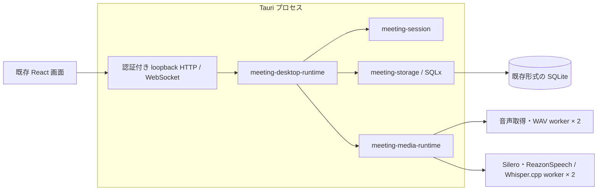

# Rust バックエンドの直接接続

既存アプリの通常画面を使い、会議管理・音声制御・SQLite 保存を Tauri 内の Rust ライブラリで実行する開発用経路です。
通常起動では Python・uv を起動しません。DOCX の取り込み時だけ共通 Python worker を呼び出します。
会議管理・保存・音声中継の CLI worker は介在しません。



HTTP / WebSocket adapter は既存画面の契約を保つためのものです。
Python の API サーバーや Rust ドメイン処理用の追加プロセスは介在しません。
資料変換の呼び出し・配布方法は [共通 Python worker](../../python-worker/README.md)を参照してください。

## 起動

現在の取得・録音 adapter は Linux の PulseAudio / PipeWire 用です。
リポジトリのルートで実行します。

```bash
cargo build --release --locked --manifest-path crates/meeting-audio-runtime/Cargo.toml
npm run dev:rust
```

事前に [音声 worker のビルド](../../test/rust-native-backend/README.md#reazonspeech-版のビルドと実行)を行ってください。
句読点モデルは同じ文書の「日本語の句読点復元」を参照してください。
ReazonSpeech モデルは設定画面から取得できます。既にビルド・モデル取得済みなら再実行は不要です。

開発時は次を自動参照します。別の配置を使う場合は対応する環境変数を指定できます。

| 対象 | 既定の配置 | 環境変数 |
|---|---|---|
| 音声取得 | `crates/meeting-audio-runtime/target/release/meeting-audio-runtime` | `MEETING_AUDIO_WORKER` |
| 推論 | `test/rust-native-backend/target/release/meeting-native-backend` | `MEETING_REAZON_WORKER` |
| ReazonSpeech | Hugging Face の共有キャッシュ（下記） | `MEETING_REAZON_MODEL` |
| 句読点 | `test/rust-native-backend/target/models/punctuation-bert` | `MEETING_REAZON_PUNCTUATION` |

環境変数には絶対パスを指定してください。既定の句読点モデルはディレクトリが存在する場合に使用します。
明示した句読点モデルをロードできない場合は準備エラーになります。
Silero threshold と無音時間は既存の設定画面で変更できます。既定値はそれぞれ 0.4、0.4 秒です。
取得レートは 16 kHz です。デバイスは画面接続時に開き、モデル未準備でも両入力の音量メーターが動きます。
モデルは「音声認識を準備」で開きます。正常に会議を保存した後もモデルを保持し、次の会議で再利用します。
音声設定・入力デバイスの変更、準備解除、アプリ終了時には解放します。

`dev:rust` は `rust-backend` feature と `tauri.rust.conf.json` を使い、Python resource の準備をスキップします。
起動ログに `Rust in-process backend is ready (Python worker starts only on demand).` と表示します。
`npm run tauri -- dev` は引き続き既存 Python 経路、`dev:native` は独立した音声検証画面です。

保存先は既存アプリと同じ app-data directory です。履歴スキーマを維持しているため、既存履歴も参照できます。
開発テストは一時 DB と合成音声で行い、実ユーザーの履歴をテストに使用しません。

## 対応範囲

- 通常画面から入力デバイスを選択、音声認識を準備・解除、会議を開始・終了。
- 自分・相手の文字起こし、任意の句読点復元、手入力、入力別の WAV 保存。
- 会議コンテキストの JSON 保存。
- rig による返答生成・部分表示・停止・返答スタイル・明示的に有効化した自動生成・履歴保存。
- ACP Registry からのエージェント追加・認証・更新・削除と ACP による返答生成。
- AI 接続先の一覧・返答経路の割当、API キーの接続確認、Ollama のモデル一覧。
- 既存設定画面での読み込み・保存、既存 `config.toml` の引継ぎ、音声設定の反映。
- モデル準備前・デバイス変更後・会議終了後の両入力の音量メーター。
- 履歴一覧・詳細、タイトル変更、録音再生とシーク、会議と関連ファイルの削除。
- アプリ終了時の認識結果 drain と保存。準備中の終了・解除はモデル準備を中断。
- 障害時は保存できた記録を中断した会議として保持し、履歴から閲覧・削除できる。保存失敗と停止確認失敗は別に通知する。

## 設定の保存と反映

`GET /api/settings` と `POST /api/settings` は Rust が処理します。
既存の `config.toml` を読み、未知のセクションや AI 経路の定義を保持したまま、
検証済みの変更だけを一時ファイルから原子的に置換します。TOML のコメントと整形は再保存時に変更されます。
ファイル未作成時の既定値は、共通の `config.default.toml` をビルド時に取り込んで利用します。
Python は呼び出しません。既存 `usage.jsonl` の当月利用量も読み取ります。

会議中やモデル準備中の音声設定変更は 409 を返します。
音声設定を保存すると準備済みの推論プロセスを閉じ、音量監視を再開します。
次の「音声認識を準備」で更新した値を渡します。
現在の Rust 音声構成で扱えない backend・VAD・言語・サンプルレートへの変更は、
ファイルを変更せずエラーにします。

API キーは通常の設定 TOML に含めず、Python と同じ service 名の OS キーストアに保存します。
既存の `secrets.toml` も読み取り、更新・削除後に古い値が復活しないよう該当キーを除去します。
OS キーストアを利用できない場合、読み取りは既存ファイルを参照できますが、新しい保存はエラーになります。
従来のファイル保存を明示的に使う場合は `SECRET_STORE_BACKEND=file` を指定します。
ファイルは Unix では 0600 で作成します。設定保存が失敗した場合は変更した認証情報を復元し、
復元にも失敗した場合は別のエラーで通知します。API が返すのはキーの有無だけです。

## AI 返答の直接接続

`rig-core` 0.42.0 をモデル API の adapter として利用します。
OpenAI、Gemini、Anthropic、Ollama の返答経路を既存の設定画面から選択できます。
Rust 構成では実サービスでの E2E 検証が未完了のため、これらの経路も試験提供と表示します。
クラウド経路の `ready` は認証情報の設定状態を表し、有効性は接続確認で検証します。
Ollama は接続と設定済みモデルの存在を確認します。モデル名は既存の
`[ai.routes.<route>].model` を引き継ぎ、接続先が loopback 以外の場合はローカル処理と表示しません。

通常の起動では AI クライアントを生成せず、生成要求が来たときに接続します。
会議の文脈と指定された発言までの履歴を使い、有効な返答スタイルを優先順に実行します。
部分結果は既存の WebSocket 契約で通知し、正常完了した返答案だけを SQLx で保存します。
停止は生成 ID と対象発言 ID が一致する要求だけに適用します。
保存中の停止は commit の完了を待ち、完了済みの返答を取消済みとは通知しません。
会議終了・設定変更・アプリ終了では未完了の生成を中断します。
自動生成は既定で無効で、有効にした場合だけ相手の発言に対して起動します。

`usage.jsonl` に要求開始・完了を記録し、同じ要求を二重計上せず、当月と会議単位の利用量を集計します。
本文や認証情報は記録しません。価格は既存 Python 実装の概算表を引き継ぎます。
停止・通信障害で利用量を取得できなかったクラウド要求や、概算価格が未登録のモデルは利用量不明として保持します。
予算が有効な場合、集計対象に不明な利用量があると追加のクラウド生成を拒否します。
これは生成前の概算チェックで、サービス側の厳密な課金上限ではありません。

## ACP エージェント

設定の「支援方法」で「エージェントを追加」を開き、一覧から追加します。
必要な場合は表示された認証方法でログインし、接続済みになったエージェントの「返答案」を選んで設定を保存します。
認証方法を提示するエージェントは、接続済みでも「ログイン方法を変更」から選び直せます。再認証後は新しい session で接続を確認します。
導入と認証は即時に反映され、返答経路の割当は設定保存時に反映されます。会議中は導入・更新・接続・削除を行えません。

公開 [ACP Registry](https://github.com/agentclientprotocol/registry) を一覧取得時と更新確認時に参照します。
Codex、Claude Agent、Antigravity を含むエントリを表示し、現在の OS・CPU と配布形式に対応するものだけ追加できます。
Codex 接続には Registry の `codex-acp` を使います。旧 App Server 直接経路と手動 command の ACP 経路は廃止しました。
旧 `codex`・`acp` の割当は読み込み時に未選択として扱い、Registry で導入・接続したエージェントを選び直します。
既存の `acp:<id>` の割当と導入済みエージェントは保持します。

- npm 形式には GUI の PATH から実行できる Node.js と npm が必要です。Registry の version を上限に、npm の `min-release-age`・`before` 設定を満たす版をアプリ専用ディレクトリに導入し、install script は実行しません。実際の導入版を保存・表示するため、配布版より古い場合があります。更新確認は一時的な lockfile の解決だけで行い、導入可能な新版がなければ更新通知を出しません。
- binary は zip、tar.gz / tgz、単体実行ファイルに対応します。uvx とその他の圧縮形式には未対応です。
- 認証はエージェントが提示する方法を使います。エージェント側でブラウザー等を開く方式に対応し、terminal 認証は提示しません。
- 保存先は app-data 内の `agents/` です。更新を明示するまで導入済み version を使用し、削除はアプリが導入したファイルだけを対象とします。
- 認証情報の保存とサービスの料金は各エージェントが管理します。ACP の生成費用は未確定と記録し、金額の予算上限が有効な場合は生成を開始しません。

導入済みエージェントがある場合、起動から約30秒後に更新確認を試み、以後は最終確認から24時間以上経過した場合に確認します。
会議中は終了後へ延期し、確認の途中で会議を開始した場合も確認を中断します。最終確認時刻と配布情報は `agents/updates.json` に保存します。
設定には導入可能な更新の件数と「まとめて更新」を表示し、個別更新・手動確認も行えます。会話画面には通知しません。
適用は明示操作で行います。新版を別ディレクトリに導入して接続を確認してから切り替え、失敗時は旧版のファイル・導入情報・接続を保持します。
まとめて更新で一部が失敗しても他の更新は続行し、結果を設定に表示します。再認証が必要な新版も自動では切り替えません。

公式 Rust SDK `agent-client-protocol` 2.2.0 を使い、初期化・認証・session 作成を検証します。
設定から接続し、保存済みの選択経路は画面の経路一覧取得時にも接続を準備します。これらの操作でモデルへ prompt は送りません。
process は再利用しますが、文脈の混入を避けるため返答ごとに session を作成し、32 回の正常終了後に process を再作成します。
初期化は 60 秒、認証は 180 秒、session 作成は 30 秒、prompt は 90 秒で期限切れになります。
既存の返答全体の期限も適用されるため、起動・待ち行列の時間も含まれます。

会話の文脈・参照資料を含む prompt を選択したエージェントへ送ります。
client は file / terminal capability を提供せず、permission request を拒否します。外部操作や未完了の返答は保存しません。
エージェント自体は利用者権限の外部プログラムであり、これらの制限は OS sandbox ではありません。
SDK エラーや stderr の生データは表示・記録しません。

実サービスでの認証・生成速度・各 OS での desktop E2E は未検証です。詳細な判断は
[ADR-017](../adr/017-acp-registry-and-shared-rust-client.md)を参照してください。

## 資料と保存管理

開始画面の Markdown・テキストは Rust、DOCX は共通 worker の MarkItDown で取り込みます。
DOCX を使う前に `npm run build:python-worker` を実行してください。
上限は 10 件、1 件 10 MiB、合計 20 MiB、抽出本文は各 40,000 文字です。
DOCX は見出し・表などを Markdown に変換します。変換時に外部サービスや LLM を呼びません。
解析できない資料は失敗状態で保存し、解析できた資料だけを返答生成に使います。
既存形式の `meetings/<id>/references/<document-id>/` にメタデータと抽出本文を保存します。
返答には先頭 3 件の本文を各 1,500 文字まで渡します。

前提資料フォルダの `.md` は会議開始時と再読み込み要求時に読みます。
起動時には読みません。返答に含める前提資料は最大 4,000 文字です。
クラウドの返答経路を選ぶと、これらの参照本文も生成要求に含まれます。

設定画面の「録音の整理」は、終了済み会議について期限・録音合計容量で対象を確認し、
確認ダイアログから実行できます。期限は指定日の UTC 0 時より前、容量超過分は古い順に選びます。
設定保存だけでは削除せず、進行中・中断・未確定の会議は一括削除の対象外です。
対象確認後に対象や容量が変化した場合、実行 API は 409 を返して再確認を求めます。

削除対象は録音・会議履歴・保存資料です。ファイルを削除してから DB を削除し、
ファイル削除に失敗した会議の DB 情報は再試行用に保持します。
途中の I/O エラーで一部のファイルだけが削除されることはあります。
結果は削除済み・失敗・対象外の ID に分けて返し、他の会議の処理を継続します。

## 音声モデルの管理

既存の設定画面から ReazonSpeech と Whisper の取得状況確認・ダウンロード・再試行・キャンセルができます。
この処理は Rust が所有し、Python や uv を起動しません。起動時と状態確認時には通信しません。
Vosk の認識・モデル管理・設定項目は削除しました。以前取得したユーザーのファイルは削除しません。

保存先は `HF_HUB_CACHE`、`HUGGINGFACE_HUB_CACHE`、`HF_HOME/hub`、
`XDG_CACHE_HOME/huggingface/hub`、`~/.cache/huggingface/hub` の順に解決します。
`models--owner--repo/{blobs,snapshots,refs}` と共有ロックを使い、Python の huggingface_hub が作ったキャッシュも再利用します。
`HF_HUB_OFFLINE=1` では新規取得を開始しません。共有モデルを削除する API は設けていません。

ReazonSpeech は既存の K2-v2 int8 の固定 revision を取得し、ファイルの SHA-256 を検証します。
`MEETING_REAZON_MODEL` は読み取り専用の配置指定です。明示指定が不完全なら準備エラーとし、その場所にダウンロードしません。
指定がなければ共有キャッシュを優先し、開発時だけ旧 `test/rust-native-backend/target/models/reazonspeech` も読み取ります。
Whisper は `ggerganov/whisper.cpp` の `ggml-{model}-q8_0.bin` を取得します。
`tiny`、`base`、`small`、`medium`、`large-v2`、`large-v3-turbo` を選択できます。
固定 revision `5359861c739e955e79d9a303bcbc70fb988958b1` の選択ファイルだけを SHA-256 検証して保存します。
同じ revision の Hugging Face キャッシュは `refs/main` がなくても再利用します。
既存 Python の faster-whisper / CTranslate2 モデルとは別形式・別リポジトリであり、上書きや変換はしません。
取得途中の一時ファイルはキャンセル時に消し、検証済みの共有 blob は再利用のため残します。

## Whisper.cpp の実行

設定の「聞き取り方法」で端末内・高精度を選ぶと、Rust 経路は `whisper-rs 0.16.0` / whisper.cpp 1.8.3 を使います。
モデル取得後に音声認識を準備してください。既存 Python 経路は引き続き faster-whisper です。

- Silero が発話を区切り、Whisper の確定結果を自分・相手別に表示・保存します。途中認識はありません。
- 無音時間は設定に従い、連続発話は約 28 秒で分割します。日本語・英語・自動判定に対応します。
- 句読点は Whisper の出力を使い、追加の句読点モデルはロードしません。
- 入力ごとにモデルと推論状態を保持するため、2 入力ではモデル 2 個分のメモリが必要です。
- 待ち行列は入力ごとに最大 60 秒です。遅延を通知し、上限超過・欠落時は認識を停止してエラーを表示します。
- 1 回の推論期限は 120 秒、停止時の排出期限は 30 秒です。認識が失敗しても、処理を回収して保存できた記録を中断した会議として保持します。
- 録音は推論と独立しています。録音の再認識機能はまだありません。

CPU 版は次のコマンドでビルドします。共有ライブラリの準備・配置は上記の音声 worker ビルド手順と共通です。

```bash
cargo build --release --locked --manifest-path test/rust-native-backend/Cargo.toml --features reazonspeech
```

Linux / Windows の Vulkan 版は Vulkan SDK（`glslc` を含む）と対応ドライバーを用意し、次の feature を指定します。

```bash
cargo build --release --locked --manifest-path test/rust-native-backend/Cargo.toml --features reazonspeech,vulkan
```

CUDA は `reazonspeech,cuda`、Metal は `reazonspeech,metal` を指定します。これらはビルド時の選択であり、
CPU 版に実行時設定だけで GPU 対応を追加することはできません。Windows / macOS の音声取得・配布は未対応です。

実行デバイスは設定画面の「自動」「CPU」「GPU」で選択します。
GUI は設定済みの推論 worker に `--capabilities` でビルド時の GPU 対応を問い合わせます。
CPU 専用版では「GPU」を無効化し、理由を表示します。確認中・worker が古い場合・起動できない場合も選択できません。
既に保存されている GPU 設定は変更せず、「自動」または「CPU」への切り替えを案内します。
この問い合わせではモデルや GPU を初期化しません。Rust 専用の `GET /api/stt/capabilities` が
`whisper_gpu` を返し、確認できない場合は `null` になります。実機での GPU 利用可否は準備時に判定します。
自動は GPU 対応ビルドで GPU を試し、初期化できなければ CPU を使います。
準備完了時に実行デバイスを通知します。GPU を明示指定した場合は CPU に黙って切り替えずエラーにします。
GPU 判定は固定した whisper.cpp 版の初期化通知を利用するため、依存更新時に検証が必要です。

## 中断した会議

中断した会議は既存の履歴画面で閲覧・削除できます。専用の復旧画面は設けません。
認識障害後も子プロセスの終了・回収と保存先を確認できれば次の会議を開始できます。
停止を確認できない場合だけ再起動を案内します。
起動時には残った会議を中断状態へ整理し、確定済みの録音を検証して履歴へ登録します。
未確定・破損した録音の修復、失われた文字起こしの復元は行いません。
詳細は [中断会議の仕様](../adr/018-interrupted-meeting-history.md)を参照してください。

## 未移植の機能

音声認識はローカルの Whisper / ReazonSpeech を提供します。以前のクラウド経路は移植対象から外します。
議事録生成と専用割当は廃止し、保存済みの本文だけを履歴に残します。詳細は [ADR-019](../adr/019-local-speech-and-saved-history.md) を参照してください。
話者分離は既存 Python でも実処理がなく、新規機能として別途検討します。

情報 AI（会議中のメモ自動更新・調査）は機能から削除し、移植対象に含めません。
設定・画面・生成処理・WebSocket コマンドから情報 AI を取り除いています。
古い設定の `ai.assignments.info` と `agents.info_enabled` は無視します。
過去の会議の `ai_note` は履歴として保持します。

対応していない provider 種別や独自の key reference は既定経路へ置き換えず、未対応として扱います。
未設定の hosted service は `not_offered` のままです。

汎用 provider plan、Windows / macOS の取得、配布用 worker と共有ライブラリの同梱も後続の作業です。
`tauri.rust.conf.json` では bundle を無効にしており、一般配布が完成した状態ではありません。

Python が必要な AI 機能は、後続の移植で共通 PyInstaller worker のサブコマンドとして追加します。
この直接接続の経路に Python の仲介を戻す必要はありません。

## 検証

[Rust ライブラリの統合テスト](../../crates/meeting-desktop-runtime/README.md#検証)は合成 worker と一時 DB で動きます。
rig の通信はローカルの模擬 HTTP / SSE サーバーを使い、API ごとの送信形式、
返答の保存、停止、途中切断、世代の再送、自動生成、複数スタイルを検証します。
ACP は合成エージェントで認証、session 分離、process 再利用、中断、異常終了、permission 拒否を検証します。
Registry の展開では path traversal とリンクの拒否を検証します。
実際の認証情報・外部 AI サービスはテストに使用しません。
画面の接続先選択は `src/__tests__/App.rustBackend.test.tsx` で検証します。
実デバイスの音質・長時間稼働や一般配布は別途検証が必要です。
